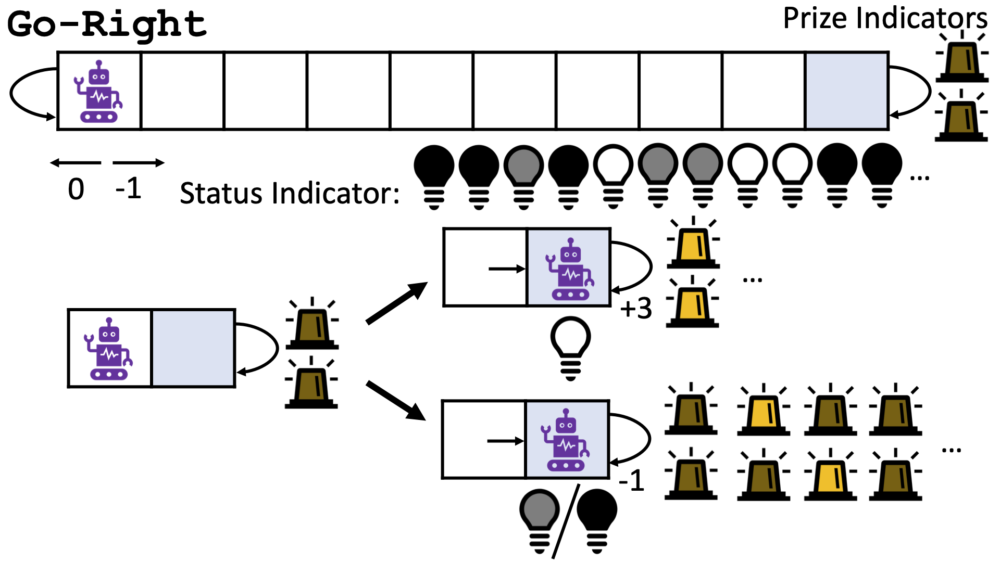

# GoRight Environment

A **Python** implementation of the *GoRight* environment described in:

> [**Erin J Talvitie, Zilei Shao, Huiying Li, Jinghan Hu, Jacob Boerma, Rory Zhao, and Xintong Wang.**
> *"Bounding-Box Inference for Error-Aware Model-Based Reinforcement Learning." Reinforcement Learning Journal, vol. 5, 2024, pp. 2440–2460.* ](https://rlj.cs.umass.edu/2024/papers/Paper356.html)

## Environment Dynamics

The *GoRight* problem is a compact RL domain that poses a significant exploration challenge. The state includes:

1. **Position**:  
   - Integer $\{0, \dots, 10\}$.  
   - Observed as a float with an offset in $[-0.25, 0.25]$.  
   - Actions `left`, `right` shift the agent’s position by $\pm 1$.

2. **Status Indicator** ($\{0,5,10\}$):  
   - Observed with an offset $\in [-1.25,1.25]$.  
   - Follows a deterministic 2nd-order Markov pattern defined by a small transition table (see the paper).  
   - If the agent **enters** position 10 **while** this status is at **10**, the prize condition is triggered.

3. **Prize Indicators** ($\{0,1\}$):  
   - 2 indicators in standard *GoRight*, or 10 in *GoRight10*.  
   - Observed with offsets $\in[-0.25,0.25]$.  
   - They are all `0` outside position 10; they turn fully `1` (all on) *only* when the agent has successfully hit the prize condition. Otherwise, if the agent is in position 10 but has *not* triggered the prize, the lights cycle in a patterned sequence (e.g., the first light goes on, then the second, etc.)  

4. **Rewards**:  
   - `0` for a `left` action.  
   - `-1` for a `right` action *unless* the agent is in position 10 with *all* prize indicators = `1`, in which case the `right` action yields `+3`.  

Although the underlying dynamics are discrete, the agent sees position and indicator intensities with small offsets. This design encourages algorithms to handle slightly noisy, continuous observations.

Below is a figure from the original paper showing the schematic of GoRight:



_(Image credit: Talvitie et al., 2024)_

## Installation

You can install this environment using either **pip** or **uv** (a package manager/distribution manager for Python).
**Note**: If you're unfamiliar with `uv`, you can skip directly to the `pip` instructions.

### 1. Installing via `uv`

   ```bash
   uv add https://github.com/cruz-lucas/goright.git
   ```
   This should handle the necessary dependencies and set up the virtual environment if you have a `pyproject.toml` file, if not, see use `uv init`.

### 2. Installing via `pip`

   ```bash
   pip install git+https://github.com/cruz-lucas/goright.git
   ```
   This command installs the GoRight environment into your Python environment (**consider using a virtual environment**).

## Usage

Once installed, you can use the environment as follows:

```python
import gym
import goright  # This import registers the environment

env = gym.make("GoRight-v0")
obs = env.reset()

discounted_reward = 0
max_step = 500
discount = 0.9
for step in range(max_step):
    action = env.action_space.sample()  # random action
    next_obs, reward, terminated, truncated, info = env.step(action)
    discounted_reward += discount ** step * reward

env.close()
print(f"Final discounted reward: {discounted_reward}")
```

If the environment is not tied to `gym.make`, you can still interact with it directly by instantiating it as described in the code within this repository. See `goright/goright.py` for more details.

## Citing

If you use this implementation for your research or reference, please cite the original paper:

```
@article{talvitie2024bounding,
    title={Bounding-Box Inference for Error-Aware Model-Based Reinforcement Learning},
    author={Talvitie, Erin J and Shao, Zilei and Li, Huiying and Hu, Jinghan and Boerma, Jacob and Zhao, Rory and Wang, Xintong},
    journal={Reinforcement Learning Journal},
    volume={5},
    pages={2440--2460},
    year={2024}
}
```

## Contributing

Contributions and suggestions to improve this implementation are always welcome. Feel free to open an issue or a pull request.

## License

This project is licensed under the [MIT License](LICENSE). Please see the [LICENSE](LICENSE) file for more information.
